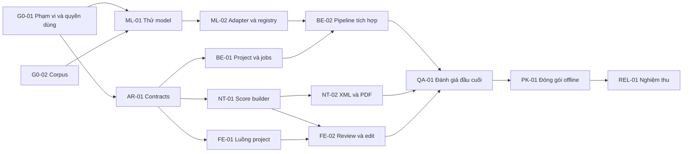

# Backlog triển khai dành cho team/agent

Áp dụng cùng [kế hoạch triển khai](IMPLEMENTATION_PLAN.vi.md) và [nghiên cứu](RESEARCH_NOTES.vi.md). Mục tiêu MVP: **lead sheet có giai điệu + hợp âm, chạy local trên RTX 3060 12 GB / RAM 32 GB**. Đây là công việc cần thực hiện, không phải danh sách tính năng đã xây xong.

## 1. Quy tắc điều phối

- Mỗi ticket có một owner, đầu vào, artifact bàn giao và tiêu chí hoàn thành. Review phải dựa trên artifact thực tế.
- Lead sở hữu API/ScoreDocument/ADR; thay schema cần thông báo agent liên quan trước khi merge. Các agent làm các module tách biệt.
- Không train model hoặc viết editor phức tạp trước khi gate feasibility qua.
- Một GPU chỉ có một job thử nghiệm. Các agent dùng chung máy đặt hàng đợi cho benchmark, không khởi chạy song song nhiều model.
- Mọi báo cáo tách **đã chạy đo**, **nguồn upstream công bố**, **suy luận**, **chưa kiểm chứng**.
- Dữ liệu audio thử và credentials không đưa vào Git; fixture tổng hợp hoặc được phép chia sẻ được lưu riêng với provenance.
- Không đưa dữ liệu mock vào trạng thái “inference thành công” của bản chạy thật.

## 2. Cấu trúc repository đề xuất

```text
apps/
  web/                         # React/TypeScript; không chứa model logic
  launcher/                    # Launcher rồi Tauri nếu được chọn
services/
  api/                         # FastAPI, jobs, projects, artifacts
workers/
  sheetsage2/                  # Runtime + model adapter + lockfile riêng
  notation/                    # ScoreDocument → notation/XML/MIDI
  renderer/                    # Điều phối MuseScore/PDF
packages/
  contracts/                   # JSON Schema/OpenAPI/TS types sinh từ schema
  score/                       # Quy tắc dữ liệu và typed edit commands
models/
  registry/                    # Manifest nguồn/revision/license; không chứa token
evaluation/
  manifests/                   # Corpus và nhãn, chia development/holdout
  protocols/                   # Định nghĩa metrics, cấu hình và gate
  reports/                     # Số đo máy thật + manifest chạy
tests/
  fixtures/notation/
  integration/
  e2e/
docs/
  adr/
  setup/
  user-guide/
```

Dữ liệu runtime đặt ngoài source tree, ví dụ thư mục người dùng chọn. Mỗi project có `original/`, `runs/<run_id>/`, `scores/<revision>/`, `exports/<revision>/` và `manifest.json`. Chỉ API được cấp artifact ID/path nội bộ; frontend không đọc ổ đĩa tùy ý.

## 3. Thứ tự và phụ thuộc



Ba nhánh có thể chạy cùng lúc sau hợp đồng dữ liệu: Backend, Notation và Frontend. ML tiếp tục theo lượt GPU hoặc làm reviewer/integrator. Khi chỉ có một agent, đi theo thứ tự dependency; không cần mô phỏng sáu vai trò bằng sáu ứng dụng khác nhau.

## 4. Các ticket thực thi

### G0-01 — Khóa phạm vi, điều kiện sử dụng và quyết định kiến trúc

**Owner:** Lead. **Phụ thuộc:** không. **Ước lượng:** 0,5–1 ngày.

Việc làm:

1. Xác nhận Windows/driver/CPU/disk và mục đích cá nhân, nội bộ hay phân phối thương mại; không cần chờ để viết schema/corpus.
2. Viết ADR cho lựa chọn lead sheet trước, local inference, model adapter, ScoreDocument và runtime tách biệt.
3. Lập manifest model cha/adapter/code/binary; đánh dấu license còn mở và điều kiện cần trước phân phối.
4. Chọn profile R&D được phép thử; mô tả đường thay model nếu quyền sử dụng không phù hợp.

**Bàn giao:** ADR, phạm vi P0/P1/P2, license/provenance matrix, cấu hình máy mục tiêu.  
**Đạt khi:** không còn hiểu lẫn lead sheet với arrangement/full score; mọi điều kiện chưa rõ có owner và gate xử lý.

### G0-02 — Bộ mẫu và protocol đánh giá

**Owner:** QA + người đọc nhạc. **Phụ thuộc:** không. **Ước lượng:** 1–2 ngày cho pilot; mở rộng trong các tuần sau.

Việc làm:

1. Chuẩn bị 12–20 đoạn đa dạng theo kế hoạch; có bản hòa âm/instrumental thực người dùng quan tâm.
2. Annotate melody, chord, beat/downbeat và đoạn không có melody; ghi người kiểm, độ mơ hồ và quyền sử dụng.
3. Chia theo bài/nhóm biến thể để giữ holdout độc lập; định nghĩa metrics và gate trước khi dùng holdout.
4. Tạo notation fixture tổng hợp cho cases khó mà không cần model.

**Bàn giao:** corpus manifest, reference files, metric protocol, fixture catalogue.  
**Đạt khi:** người khác chạy cùng script ra cùng cách tính metric; reference không lấy từ chính prediction đang đánh giá.

### ML-01 — Spike SheetSage2 trên RTX 3060

**Owner:** ML/Runtime. **Phụ thuộc:** G0-01 và bộ pilot G0-02. **Ước lượng:** 3–5 ngày, timebox rõ.

Việc làm:

1. Đọc custom code cần thực thi; pin revision đầy đủ và các dependency model cha. Ghi checksum, điều khoản, driver và runtime.
2. Cài runtime Python riêng theo upstream; thử native Windows default path trước, không nâng package hàng loạt.
3. Chạy smoke test 30 giây; kiểm có ABC/MIDI/events và đúng loại output.
4. Chạy bài 3 phút, 5 phút và >5 phút để kiểm peak memory, thời gian, stitching/token-limit. Chú ý padding 300 giây: clip ngắn không chứng minh VRAM thấp.
5. Render PDF native offline để có baseline đầu cuối; lưu artifact thực và lỗi gặp phải.
6. Chấm pilot; đo note pitch tuyệt đối/octave, chords, nhịp, thời gian sửa tay. Đọc các trường hợp lỗi chứ không chỉ lấy điểm trung bình.
7. Nếu lỗi native, dành tối đa 1 ngày tìm nguyên nhân rồi thử WSL2 như phương án riêng. Nếu OOM, áp các bước ở kế hoạch; không tự đổi context rồi coi là cùng model profile.

**Bàn giao:** CLI/script tái lập, lockfile, raw artifacts, `feasibility-report` có go/no-go theo phần cứng/chất lượng/quyền dùng.  
**Đạt khi:** một đường inference local được đo thực, hoặc kết luận không đạt có bằng chứng và đề xuất adapter thay thế. Go/no-go không được ghi “đạt” từ đọc model card.

### ML-01B — Dự phòng khi model chính không đạt

**Owner:** ML + Notation. **Phụ thuộc:** ML-01 có failure hoặc rủi ro chưa giải quyết. **Ước lượng:** timebox 2–3 ngày cho đánh giá, triển khai thêm được lập lại sau quyết định.

Việc làm:

1. Nếu lỗi tài nguyên/tốc độ, thử SheetSage1 default không Jukebox để có đối chứng full-mix; ghi riêng môi trường Linux/WSL2 và điều kiện weights/dependencies.
2. Thử chuỗi thu hẹp: melody stem → Basic Pitch; full mix → Beat This!; full mix → chroma/template major-minor + temporal smoothing → chord editor.
3. ChordFormer chỉ thử khi điều kiện code/weights và device được làm rõ; không mặc định đã có official HF release.
4. Ghép vào cùng ScoreDocument; đo số thao tác người dùng, memory và quality bằng pilot chung.
5. Nếu cần stem/MIDI đầu vào, ghi thay đổi phạm vi và yêu cầu Lead chốt trước khi gọi là MVP đạt mục tiêu full-mix.

**Bàn giao:** bảng so sánh model chính/A/B, artifact thật, phạm vi hỗ trợ và quyết định.  
**Đạt khi:** có phương án đủ melody + chord + beat được đo; nếu không thì báo gate chưa đạt, không gán Basic Pitch đơn lẻ thành lead-sheet engine.

### AR-01 — Khóa contract dữ liệu và API v1

**Owner:** Lead + Backend + Notation. **Phụ thuộc:** G0-01; dùng fixture trong lúc chờ ML-01. **Ước lượng:** 2–3 ngày.

Việc làm:

1. Định nghĩa raw-event schema, ScoreDocument, time-map, diagnostics, typed edit command và version migration.
2. Quy định đơn vị: giây tuyệt đối so với audio gốc; quarter-note fractions cho notation; transpose/concert pitch rõ ràng.
3. Định nghĩa adapter `describe`, `prepare`, `transcribe`, `cancel`, `release`; capabilities không được suy từ tên model.
4. Viết OpenAPI theo các endpoint đã đề xuất; lỗi typed và event sequence cho reconnect.
5. Xuất fixture JSON có pickup/6/8/slash chord và TypeScript types từ schema.

**Bàn giao:** schema v1, OpenAPI, adapter protocol, fixtures, ADR versioning.  
**Đạt khi:** frontend/backend/notation parse cùng fixtures; không có trường duration không rõ đơn vị; sửa score dùng expected revision.

### ML-02 — Adapter production và quản lý model

**Owner:** ML/Runtime. **Phụ thuộc:** ML-01 đạt, AR-01. **Ước lượng:** 3–5 ngày.

Việc làm:

1. Bọc pipeline upstream thành worker với typed messages; không import model vào API process.
2. Nạp model bằng revision/profile đã nghiệm thu; chuyển output thành raw schema nhưng giữ original artifact.
3. Download có checksum, resume và kiểm free disk; chỉ registry approved được cài từ UI.
4. Tạo capability matrix, runtime manifest, hardware preflight, lỗi gated-download/OOM/missing dependency rõ ràng.
5. Đảm bảo chạy lại offline và giải phóng GPU; không lưu token trong job/project.
6. Giữ stitching upstream đã pin; kiểm offset, note/chord trùng/mất và note nối qua overlap với bài dài. Đổi chunk/overlap tạo profile thử nghiệm mới.

**Bàn giao:** adapter, registry manifest, installer model, fixture output thật.  
**Đạt khi:** 10 job tuần tự ổn định; model version tái lập; không có outbound audio; lỗi chưa cài model không bị giả thành file rỗng thành công.

### BE-01 — Projects, artifact store và job manager

**Owner:** Backend. **Phụ thuộc:** AR-01. **Ước lượng:** 4–6 ngày.

Việc làm:

1. SQLite migrations, project CRUD, audio import stream, SHA-256 và giới hạn input.
2. Job queue có stage checkpoints, một GPU lease, timeout, cancel và retry. Trạng thái review thuộc score; transcription completed giải phóng worker, export dùng job riêng.
3. SSE reconnect qua event sequence; progress theo stage, chưa có ETA thì không dựng số giả.
4. Artifact read qua ID, path confinement, write-atomic; lock và revision để không ghi đè sửa thủ công.
5. Bind loopback; kiểm Origin/Host/session; log không chứa token hay audio payload.

**Bàn giao:** API hoạt động với fake worker được đánh dấu test-only; integration tests recovery/cancel.  
**Đạt khi:** kill worker giữa chừng không hỏng project; retry không nhân đôi artifact; API vẫn phản hồi khi GPU đang bận.

### NT-01 — Dựng score từ sự kiện âm nhạc

**Owner:** Notation. **Phụ thuộc:** AR-01, raw fixtures ML-01 khi có. **Ước lượng:** 5–8 ngày.

Việc làm:

1. Chuyển events thành time-map, measures, notes/rests/harmonies; giữ mapping về audio.
2. Tách lựa chọn melody khỏi raw predictions; hỗ trợ instrumental/vocal theo đoạn.
3. Dựng meter/key/tempo map, pickup, quantization và tie/rest; hỗ trợ fraction và tuplet trong data model.
4. Thêm validator trường độ mỗi voice/measure, note durations, pitch spelling, chord intervals; phân biệt chord/no_chord/unknown, xử lý gap/overlap và qua vạch nhịp nhất quán.
5. Mỗi biến đổi tạo provenance/diagnostic; bản AI gốc không bị sửa.

**Bàn giao:** score builder, validators, golden fixtures, báo cáo các rhythmic cases chưa tự động hóa tốt.  
**Đạt khi:** fixture khó đúng cấu trúc; không bỏ mất melody/chord; không sửa pitch để cưỡng ép theo giọng; backing-only có trạng thái kiểm tra phù hợp.

### NT-02 — Xuất MusicXML, MIDI và PDF

**Owner:** Notation + Runtime. **Phụ thuộc:** NT-01. **Ước lượng:** 3–5 ngày.

Việc làm:

1. ScoreDocument → music21 → MusicXML 4.0; chord là harmony symbol, không trộn thành melody notes.
2. MIDI từ score đã chỉnh; MIDI raw lưu tên/trạng thái khác. MIDI mặc định melody, tùy chọn accompaniment từ chord với track riêng và nhãn nguồn sinh để nghe thử.
3. PDF từ MusicXML qua MuseScore bản đã test; title/font tiếng Việt, layout A4 và page breaks.
4. Schema validation offline và round-trip qua app notation; so notes/timing/ties/harmony/meter/key đã canonicalize.
5. Version toàn bộ export theo score revision; báo lỗi missing renderer rõ và giữ XML/MIDI đã có.

**Bàn giao:** exporters, renderer wrapper, fixture PDFs và compatibility report.  
**Đạt khi:** preview/exports cùng revision; mở MusicXML thành công; PDF không cắt/nối chồng chữ/nốt ở fixture và bài thật.

### FE-01 — Project, cài model và theo dõi phân tích

**Owner:** Frontend. **Phụ thuộc:** AR-01; mock contract trước, BE-01 khi tích hợp. **Ước lượng:** 4–6 ngày.

Việc làm:

1. Thiết lập/check hardware/model; trạng thái download/license-access/ready rõ ràng.
2. Import audio, chọn đoạn và melody role; audio preview.
3. Tiến độ job, cancel/retry/reconnect; empty/error/offline states.
4. Danh sách project, mở lại và artifact list; UI tiếng Việt.

**Bàn giao:** frontend theo OpenAPI thật; mock mode tách rõ trong development.  
**Đạt khi:** người dùng nhập file và biết job đang ở đâu; không mất trạng thái sau refresh; không cần terminal cho luồng thường ngày.

### FE-02 — Review, nghe A/B và chỉnh lead sheet

**Owner:** Frontend + Notation. **Phụ thuộc:** FE-01, NT-01, API edits. **Ước lượng:** 5–8 ngày.

Việc làm:

1. OSMD preview, waveform, audio loop và cursor theo time-map.
2. Chọn melody role theo đoạn; nghe gốc, raw MIDI và score MIDI. Viết sequencer Web Audio dùng oscillator/envelope local cho P0, có melody solo và chord accompaniment tùy chọn; kiểm note-off/seek/loop/tempo changes.
3. Form/phím tắt sửa note/rest/chord/key/meter/downbeat; ưu tiên thao tác thực dụng trước drag/drop. P0 concert pitch + transpose toàn bài; đổi đồng bộ melody/key/chord root/slash bass/playback. Ký âm nhạc cụ Bb/Eb thuộc P2.
4. Undo/redo và autosave bằng typed commands; những ô bị quantize lại hiện rõ.
5. Danh sách diagnostics dẫn tới đúng audio span/measure; trạng thái Bản nháp AI/Đã duyệt.
6. Export dialog, revision selection và mở file kết quả.

**Bàn giao:** màn hình review hoạt động với project thật, e2e cho sửa rồi xuất/mở lại.  
**Đạt khi:** người đọc nhạc hoàn thành sửa một clip mà không phải sửa JSON; rerun model không làm mất user edits; dữ liệu hiển thị và xuất giống nhau.

### BE-02 — Tích hợp pipeline đầu cuối

**Owner:** Backend + Integrator. **Phụ thuộc:** BE-01, ML-02, NT-01. **Ước lượng:** 2–4 ngày.

Việc làm:

1. Ghép worker messages, raw artifact store, notation stage và diagnostics.
2. Cache theo audio hash + model revision + config hash; invalidation đúng khi thay tham số.
3. Chạy lại inference tạo run/score mới; không ghi đè revision cũ.
4. Export stage lấy đúng snapshot score; retry stage tiếp theo không chạy lại GPU không cần thiết.

**Bàn giao:** luồng upload → review → export với tài liệu vận hành.  
**Đạt khi:** một bài thật đi hết đường mà không sửa file bằng tay; tất cả stage/lỗi có log và artifact truy vết.

### QA-01 — Đánh giá chất lượng và khả năng sửa

**Owner:** QA + người đọc nhạc. **Phụ thuộc:** BE-02, NT-02, FE-02. **Ước lượng:** 4–6 ngày.

Việc làm:

1. Chốt profile và gate trước chạy holdout; đo các metric ở kế hoạch, cả per-clip và per-group.
2. Đo thời gian sửa tay với ít nhất hai người đọc nhạc nếu có; nêu trình độ và setup.
3. A/B original/raw MIDI/score MIDI, review octave, melody selection và chord boundaries.
4. Stress bài dài, silence, file hỏng, pickup, không melody, triplet/swing, Unicode path/title.
5. Đánh giá regression trước/sau tối ưu model hoặc notation.

**Bàn giao:** quality report, performance report, danh sách limitations công bố, release blockers.  
**Đạt khi:** các gate qua trên phạm vi hỗ trợ hoặc có quyết định thu hẹp rõ ràng; không che nhóm khó bằng điểm trung bình chung.

### PK-01 — Bộ cài Windows và chạy offline

**Owner:** Runtime/Packaging. **Phụ thuộc:** QA-01 đạt cơ bản, license gate cho bản định phân phối. **Ước lượng:** 4–6 ngày.

Việc làm:

1. Tạo launcher cài/kiểm runtime cần thiết; model download riêng với dung lượng và profile rõ.
2. Quản lý FFmpeg, MuseScore, fonts và soundfont; ghi notices của đúng binary. Native ABC renderer chỉ đóng gói nếu sản phẩm còn sử dụng.
3. Tauri shell nếu đem lại lợi ích đã chốt; không bắt buộc Docker để chạy app local.
4. Ngắt mạng, khởi động mới và chạy audio → sửa → PDF/XML/MIDI; xác minh không outbound request.
5. Test máy sạch/tài khoản thường, đường dẫn tiếng Việt, cổng bận, disk đầy, download đứt, GPU unavailable.
6. Uninstall giữ project theo lựa chọn người dùng; không xóa chung cache ngoài phạm vi app.

**Bàn giao:** installer/launcher, checksum, runtime/model manifests, hướng dẫn và offline report.  
**Đạt khi:** người dùng không cần tự quản Python environment cho luồng đã hỗ trợ; bộ cài tái lập; không phụ thuộc asset CDN khi offline.

### REL-01 — Nghiệm thu bản MVP

**Owner:** Lead + QA. **Phụ thuộc:** PK-01, tất cả gate.

**Bàn giao bắt buộc:** bộ cài; source/lockfiles; model manifests; mẫu PDF/XML/MIDI; benchmark report; guide tiếng Việt; limitations; license notices; quy trình update/rollback.  
**Đạt khi:** người dùng chọn một audio mới trong phạm vi hỗ trợ, tạo draft lead sheet, chỉnh, lưu, mở lại và xuất thành công trên cấu hình mục tiêu.

## 5. Ticket giai đoạn 2

| ID | Chủ trì | Việc và gate |
|---|---|---|
| P2-01 | ML | MuScriptor small/medium so với baseline trên corpus đa nhạc cụ; đo instrument/note F1 và memory, không chỉ nghe demo |
| P2-02 | ML | So mix-direct với separation+AMT; chọn đúng checkpoint/stem; chỉ giữ nhánh có cải thiện downstream |
| P2-03 | Notation | Piano grand staff/hand split, bass, instrument transpose, percussion; profile và fixtures riêng |
| P2-04 | Frontend | Part list, solo/mute, đổi nhãn instrument, export part/full score |
| P2-05 | Lead + ML | Theo dõi Harmonica/release mới; thay model sau benchmark và license review |
| P2-06 | Notation | TAB/tuning/capo và arrangement mode khi có yêu cầu; tách khỏi transcription nguyên bản |

## 6. Prompt khởi động cho agent điều phối

```text
Hãy triển khai theo IMPLEMENTATION_PLAN.vi.md và AGENT_BACKLOG.vi.md.
Mục tiêu ưu tiên là lead sheet giai điệu + hợp âm chạy local trên RTX 3060
12 GB VRAM, RAM 32 GB; Windows là giả định cần kiểm tra.

Bắt đầu G0-01/G0-02/ML-01. Đọc nguồn đã trích, kiểm tra môi trường, tạo
ADR và corpus pilot, rồi đo inference thực tế. Không cam kết model phù hợp
12 GB từ kích thước weights. Không thay model/API bằng demo giả. Không
coi giấy phép weights là giấy phép code. Không gửi audio lên dịch vụ cloud.

Trong khi ML làm feasibility, có thể giao agent khác thiết kế contract và
fixtures, dựng frontend với contract mock có nhãn development. Mỗi agent
sở hữu module tách biệt; integrator giữ schema/API. Tối đa một inference
GPU job đồng thời.

Sau gate feasibility, hoàn thiện pipeline, score editing, export rồi đóng
gói offline. Bàn giao artifact thật và số đo; phân biệt dữ kiện nguồn,
giả định, kết quả chạy và các gate còn chưa đạt. Không coi compile/schema
pass là bằng chứng bản nhạc đúng với audio.
```

## 7. Mẫu báo cáo bàn giao cho từng agent

```text
Ticket / Owner:
Input revisions và cấu hình máy:
Thay đổi / quyết định:
Artifact paths:
Kiểm thử đã chạy + kết quả:
Chất lượng / latency / memory (nếu liên quan):
Nguồn upstream và điều kiện sử dụng:
Giới hạn / lỗi còn lại:
Dependency bàn giao cho agent tiếp theo:
Gate: PASS / FAIL / CHƯA ĐO
```
