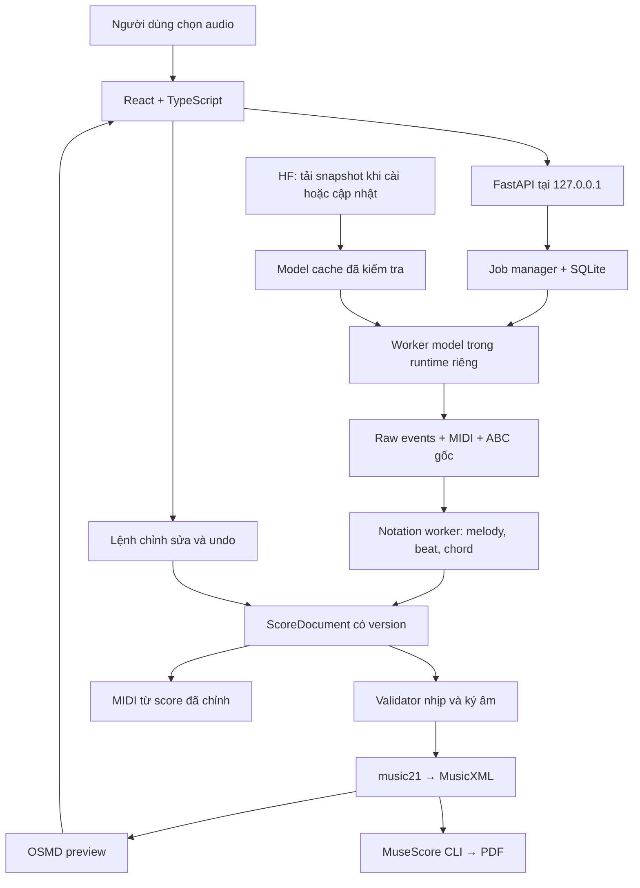

# Kế hoạch triển khai ứng dụng local tạo sheet nhạc từ audio

**Phiên bản:** 1.0 • **Ngày:** 19/09/2026  
**Ưu tiên đã xác nhận:** lead sheet gồm giai điệu và hợp âm.  
**Máy mục tiêu:** RTX 3060 12 GB VRAM, RAM 32 GB. Windows x64 là giả định cần xác nhận khi bắt đầu triển khai.  
**Trạng thái:** kế hoạch đã nghiên cứu; chưa cài, chạy hoặc benchmark model trên máy này.

Tài liệu đi kèm: [đối chiếu nghiên cứu và nguồn](RESEARCH_NOTES.vi.md), [backlog giao việc cho team/agent](AGENT_BACKLOG.vi.md).

## 1. Quyết định đề xuất

Xây ứng dụng theo hướng **audio → bản nháp lead sheet → nghe/kiểm tra/chỉnh sửa → MusicXML + PDF + MIDI**. Dùng **SheetSage2 làm ứng viên thử nghiệm đầu tiên**, nhưng chỉ chốt sau khi vượt ba cổng: chất lượng âm nhạc, chạy được trên máy mục tiêu, điều kiện sử dụng/phân phối rõ ràng. Mở rộng sang sheet từng nhạc cụ sau khi lead sheet ổn định.

Thiết kế theo model adapter để thay model mà không viết lại frontend và trình xuất sheet. Internet chỉ cần trong bước tải model/runtime hoặc cập nhật do người dùng chọn; âm thanh và inference chạy tại máy. “Kết nối Hugging Face” trong kế hoạch này nghĩa là tải weights/config có phiên bản, không mặc định gửi audio lên HF Spaces hoặc Inference API.

Không dùng một LLM tổng quát làm bộ phận quyết định nốt nhạc. Phần cốt lõi gồm model âm nhạc, cấu trúc ký âm có kiểu dữ liệu rõ ràng, các quy tắc nhạc lý và công cụ kiểm tra. LLM có thể được thêm sau để giải thích hoặc đề xuất chỉnh sửa có thể xem lại.

**Ước lượng lập kế hoạch:** bản thử đầu cuối 1–2 tuần; MVP lead sheet có chỉnh sửa và bộ cài khoảng 6–8 tuần với 3–4 người/agent chuyên trách và người đọc nhạc đánh giá. Đây là ước lượng, phụ thuộc kết quả thử model/giấy phép. Sheet đa nhạc cụ là giai đoạn tiếp theo, ước lượng thêm 4–6 tuần nếu không phải huấn luyện model mới.

## 2. Sản phẩm phải giải quyết đúng bài toán nào?

### Đầu vào và đầu ra

| Nội dung | Phạm vi MVP |
|---|---|
| Audio | WAV, MP3, FLAC; thử nghiệm tối đa 10 phút/200 MB, giới hạn điều chỉnh sau benchmark |
| Nội dung | Ca khúc có melody nghe được hoặc instrumental có nhạc cụ chơi giai điệu chính |
| Chế độ | Giai điệu chính + ký hiệu hợp âm; người dùng chọn melody nhạc cụ/giọng hát hoặc đổi theo đoạn |
| Sheet | Một khuông melody chính, hợp âm đặt trên khuông, khóa/giọng/nhịp/tempo, ô nhịp, dấu nghỉ và nối nốt |
| File | `.musicxml` hoặc `.mxl` để sửa tiếp; PDF A4 để in; `.mid` để nghe/đưa vào DAW; project để tiếp tục chỉnh sửa |
| Tham chiếu | Lưu output gốc của model, gồm ABC nếu model có, để truy vết; không nhầm với bản người dùng đã chỉnh |
| Ngoại tuyến | Mở project, inference, chỉnh sửa, nghe và xuất file được sau khi đã tải đủ tài nguyên |

**Trường hợp cần phân biệt:** nếu file chỉ có phần đệm và không có giai điệu, không thể suy ra chắc chắn melody mà tác giả chưa đưa vào. Ứng dụng phải cho kết quả hợp âm/nhịp và báo chưa xác định được melody; có thể nhận thêm track hát/lead. Sáng tác melody mới từ hợp âm là một sản phẩm khác, chỉ thêm khi người dùng chủ động chọn.

Lead sheet cũng khác bản phối piano hai tay hoặc tổng phổ. MVP dùng concert pitch, cho transpose toàn bài theo semitone và đổi octave melody; transpose phải đổi đồng bộ melody, giọng, chord root/slash bass và playback. Ký âm riêng cho nhạc cụ chuyển giọng Bb/Eb và việc chép đúng bè guitar, bass, violin trong bản mix thuộc giai đoạn sau.

### Định nghĩa “sheet chuẩn”

1. **Đúng định dạng:** file parse được, hợp lệ schema đã chọn, mở được trong MuseScore; không mất hợp âm/nhịp/nốt khi mở lại.
2. **Đọc được:** chia ô nhịp hợp lý, đủ trường độ mỗi bè, nghỉ/nối nốt đúng, ký hiệu hợp âm rõ, dàn trang không đè chữ/nốt.
3. **Đúng với audio:** cao độ và quãng tám, thời điểm/trường độ, melody chính và hợp âm được kiểm tra bằng đối chiếu audio. Mức này phải đánh giá độc lập với hai mức trên.

Mỗi kết quả ban đầu có trạng thái **Bản nháp AI**. Chuyển sang **Đã duyệt** khi người dùng xác nhận sau kiểm tra. Không hiển thị một tỷ lệ “đúng 98%” nếu chưa có xác suất đã hiệu chuẩn cho đúng dữ liệu sử dụng.

### Chưa đưa vào MVP

Tự khôi phục lyrics; guitar TAB chính xác thế bấm; tổng phổ dàn nhạc đầy đủ; sáng tác/thay melody; nhập URL YouTube; huấn luyện model từ đầu; thu âm realtime; đồng bộ cloud. Triplet, swing, rubato và đổi nhịp vẫn nằm trong bộ test, nhưng mức tự động hóa phải công bố theo kết quả thực tế và cho sửa thủ công.

## 3. Lựa chọn model và chiến lược Hugging Face

| Thành phần | Quyết định |
|---|---|
| Lead sheet | Thử `m-a-p/SheetSage2` trước; không coi HF tag/task tự sinh là API chuẩn của ứng dụng |
| Model cha | Lưu cả dependency `m-a-p/MERT-v2-FullSong` và revision tương ứng |
| Beat/downbeat đối chứng | Thử Beat This! khi đánh giá cho thấy lợi ích; không chạy thêm trong mọi job |
| Baseline nhẹ | Basic Pitch trên solo/stem sạch; muốn đủ lead sheet phải bổ sung beat, chord và melody selection |
| Multi-instrument | Thử MuScriptor small/medium ở giai đoạn 2; so trực tiếp với đầu vào mix trước khi thêm separation |
| Theo dõi | Harmonica; chỉ xét tích hợp khi tìm được release weights/code phù hợp |

Căn cứ và các giới hạn của từng model được ghi trong [nghiên cứu](RESEARCH_NOTES.vi.md). SheetSage2/MERT và MuScriptor có hạn chế NC đối với weights. Điều kiện code SheetSage2 còn cần làm rõ. **Local không tự động có nghĩa là được dùng thương mại**: nếu mục tiêu là bán ứng dụng/dịch vụ, phải có kết luận về quyền sử dụng và phân phối từng thành phần trước khi chốt model phát hành. Nguồn điều khoản: [SheetSage2 LICENSE](https://huggingface.co/m-a-p/SheetSage2/blob/main/LICENSE), [MuScriptor](https://github.com/muscriptor/muscriptor).

### Registry thay vì tự tải “latest”

Mỗi model có manifest gồm:

```text
id, task, publisher, official_source, hf_repo_id, hf_repo_type
revision_full_sha, parent_revisions, artifact_sha256, download_bytes
code_license, weights_license, dependency_notices, redistribution_status
adapter_version, runtime_lockfile, preprocessing, input_sample_rate
capabilities, output_schema, device_support, measured_memory, benchmark_id
status: candidate | approved | disabled
```

Quy trình: kiểm tra model card/code → giải quyết quyền truy cập → tải revision xác định → kiểm checksum → smoke test → benchmark → thêm vào danh sách approved. Cập nhật tạo profile mới; project cũ tiếp tục dùng revision cũ để tái lập. Không tự cập nhật model mỗi lần mở ứng dụng. HF hỗ trợ tải snapshot theo revision; đó là nền tảng cho cơ chế này. [HF download](https://huggingface.co/docs/huggingface_hub/guides/download).

`trust_remote_code=True` chỉ dùng với code đã đọc và ghim phiên bản; khi triển khai offline, nạp snapshot cục bộ đã kiểm tra. Token HF phục vụ tải model có quyền truy cập, lưu qua cơ chế bảo vệ của hệ điều hành; không ghi vào log, project hoặc bundle chia sẻ.

## 4. Kiến trúc frontend/backend



**Đường POC ngắn:** dùng output ABC và renderer native của model để có bản in tham chiếu sớm. **Đường MVP chính:** ScoreDocument → MusicXML → OSMD/MuseScore. Cả hai không được trở thành hai nguồn chỉnh sửa độc lập; dữ liệu gốc luôn được giữ riêng.

| Tầng | Công nghệ đề xuất | Trách nhiệm |
|---|---|---|
| Frontend | React, TypeScript, Vite; quản lý request/cache và state nhẹ | Nhập audio, theo dõi job, nghe A/B, xem và sửa lead sheet |
| Preview sheet | OSMD | Render MusicXML; các thao tác edit do ứng dụng cung cấp |
| Audio UI | Web Audio + waveform component có asset local | Seek/loop/solo nguồn, cursor theo time map |
| Backend API | FastAPI + Pydantic | Validate yêu cầu, project/artifact, job lifecycle, score revisions |
| Lưu trữ | SQLite + file trong thư mục project | Metadata, journal chỉnh sửa, job checkpoint và artifact |
| Inference | Worker process riêng, PyTorch CUDA | Nạp model, infer, báo tiến độ, giới hạn VRAM |
| Notation/export | Worker Python riêng với music21 | Chuẩn hóa ký âm, sinh MusicXML/MIDI và diagnostics |
| PDF | MuseScore Studio executable được ghim bản | Xuất PDF từ MusicXML đã chỉnh; kiểm tra tương thích |
| Đóng gói | Launcher local trước; Tauri 2 sau gate Windows | Khởi động/dừng backend, chọn thư mục dữ liệu, quản lý runtime |

OSMD là renderer, không cung cấp sẵn editor kiểu MuseScore. MVP sửa qua bảng nốt/hợp âm và các điều khiển theo ô nhịp; kéo thả trên khuông là hạng mục nâng cao. [OSMD](https://github.com/opensheetmusicdisplay/opensheetmusicdisplay).

Tách runtime model khỏi runtime notation giúp tránh xung đột phiên bản NumPy/PyTorch/music21. Giao tiếp worker bằng JSON Lines có schema + đường dẫn artifact nội bộ. API không trực tiếp giữ tensor hoặc chạy inference dài trong request handler. FastAPI có lưu ý riêng về tác vụ nặng ngoài BackgroundTasks. [Tài liệu FastAPI](https://fastapi.tiangolo.com/tutorial/background-tasks/).

### Job lifecycle và khả năng phục hồi

```text
Transcription job:
queued → validating → decoding → transcribing → building_score
       → validating_score → completed
Export job:
queued → validating_revision → exporting → completed
Terminal states khác: failed, cancelled
Score.review_status: needs_review | reviewed
```

Mỗi stage lưu input hash, model/config revision, artifact checksum, thời gian và lỗi. Ghi file tạm rồi đổi tên khi hoàn thành; resume chỉ dùng stage có checksum đúng. Một GPU chỉ chạy một inference job. Job phiên âm kết thúc khi lưu được score draft; chờ người duyệt không giữ worker hay GPU. Export là job riêng cho một score revision; export CPU và API vẫn phản hồi khi GPU bận.

Cancel đặt cờ để worker dừng ở điểm an toàn; nếu treo quá timeout, chấm dứt process và giữ project ở revision hợp lệ gần nhất. Retry không nhân đôi nốt, artifact hoặc lịch sử chỉnh sửa. Lỗi renderer không làm mất transcription đã có.

### API tối thiểu để các agent làm song song

| Endpoint đề xuất | Kết quả |
|---|---|
| `POST /api/v1/projects` | Tạo project, tên và tùy chọn đầu ra |
| `POST /api/v1/projects/{id}/audio` | Nhập audio, kiểm tra loại/dung lượng, lưu hash |
| `GET /api/v1/models` | Model/profile đã cài, trạng thái và khả năng |
| `POST /api/v1/model-installs` | Job tải snapshot đã được registry cho phép |
| `POST /api/v1/projects/{id}/jobs` | Phân tích hoặc phân tích lại với profile được chọn |
| `GET /api/v1/jobs/{id}/events` | SSE theo stage, kèm số thứ tự sự kiện để reconnect |
| `POST /api/v1/jobs/{id}/cancel` | Yêu cầu hủy |
| `GET /api/v1/projects/{id}/score` | ScoreDocument + revision + diagnostics |
| `POST /api/v1/projects/{id}/edits` | Lệnh sửa typed + expected_revision; trả revision mới |
| `POST /api/v1/projects/{id}/exports` | Xuất đúng score revision và tập định dạng yêu cầu |
| `GET /api/v1/artifacts/{id}` | Đọc file theo artifact ID, không cho truy cập path tùy ý |

API chỉ bind loopback; kiểm Host/Origin, dùng session token, giới hạn CORS; mọi subprocess dùng danh sách tham số, không ghép shell từ tên file. Font, JS, soundfont và asset được phục vụ local. Trạng thái model chưa cài/không đủ quyền phải xuất hiện rõ trước khi bắt đầu job.

## 5. Pipeline âm nhạc từ đầu đến cuối

### Bước 1: nhập và kiểm tra audio

Giữ file gốc bất biến. Lấy duration, sample rate, số kênh; kiểm tra file hỏng, audio rỗng và clipping. Tạo bản decode phù hợp từng adapter, không áp một sample rate cho mọi model. Lưu offset khi crop để mọi note vẫn ánh xạ về thời gian audio gốc. Không denoise/normalize mạnh mặc định vì có thể làm mất chi tiết âm nhạc.

### Bước 2: phân tích mix bằng model chính

Chạy SheetSage2 profile đã nghiệm thu, lưu output gốc và cảnh báo. Giữ hợp âm trong cấu hình P0; không bật tùy chọn melody-only làm mất chords. Phát hiện beat/downbeat, key, melody và chord trước trên mix gốc. Source separation chỉ bổ sung nếu thử nghiệm chứng minh chất lượng downstream tốt hơn.

Với bài dài, adapter giữ thuật toán stitching upstream đã ghim phiên bản trước. Kiểm tra từng ranh giới vùng overlap: timestamp về cùng audio gốc, note/chord không trùng hoặc mất, note kéo qua biên, liên tục beat/downbeat/key/meter và melody selection. ML chịu trách nhiệm raw stitching; Notation chịu trách nhiệm ánh xạ ô nhịp và tie. Mọi thay đổi chunk/overlap là profile mới cần đánh giá, không âm thầm cắt bài thành nhiều job độc lập.

### Bước 3: chọn melody chính

Cho nghe riêng melody nhạc cụ và giọng hát được dự đoán. Instrumental mặc định gợi ý nhánh nhạc cụ; ca khúc gợi ý vocal. Người dùng có thể chọn lại theo đoạn intro/verse/solo. Không nối hai melody bằng cách lấy nốt cao nhất của mỗi thời điểm. Nếu không đủ căn cứ, đánh dấu đoạn cần duyệt và cho phép để trống melody.

### Bước 4: xây time map và ô nhịp

Giữ cả thời gian thực `seconds` và vị trí nhạc `quarter_notes` dưới dạng phân số. Beat/downbeat là đề xuất có thể chỉnh. Từ anchor người dùng xác nhận, dựng tempo map và measure map; xử lý pickup, silence đầu bài, tempo biến thiên và đổi nhịp. 6/8 phải phân biệt phách chấm dôi với quarter-note đơn vị lưu trữ. Sai nhịp phải sửa trước khi quantize toàn bài.

### Bước 5: biến note events thành ký âm

Tính grid cho từng đoạn từ các lựa chọn nhịp hợp lệ; hỗ trợ trường độ chấm dôi và triplet trong ScoreDocument ngay từ đầu. Mức nhận diện tự động triplet/swing được nghiệm thu riêng. Chia note qua vạch nhịp bằng tie; thêm rest khi cần; chọn spelling theo giọng; không đổi pitch để ép nốt vào scale. Khi đơn giản hóa trường độ, lưu diagnostic và cho undo.

Giữ sự khác biệt giữa note kéo dài do performance/pedal/reverb và trường độ để đọc nhạc. Không lấy một ngưỡng min-duration duy nhất xóa mọi grace note. Những trường hợp không giải quyết được phải hiện cho người sửa.

### Bước 6: tạo ký hiệu hợp âm

Hợp âm gồm root, quality, bass nếu có, vị trí bắt đầu/kết thúc và nhãn gốc. Hiển thị thành ký hiệu trên khuông; không đưa mọi nốt của accompaniment MIDI lên melody staff. Hỗ trợ sửa C, Cm, C7, Cmaj7, sus và slash chord ở lớp dữ liệu/biên tập; khả năng AI nhận đúng từng loại được đo riêng. Giữ `N`/không hợp âm và `unknown` khác nhau; không suy đoán nốt bass đảo từ dữ liệu không có.

### Bước 7: kiểm tra, chỉnh sửa và xuất

Chạy validator rồi mở màn hình review. Người dùng sửa nhịp/key/octave/note/chord; nghe A/B audio gốc và MIDI theo score. Xuất cùng revision ra MusicXML, PDF và MIDI. Đóng project rồi mở lại phải giữ nguyên thay đổi. PDF xuất từ score đã chỉnh, không dùng nhầm ABC/raw output cũ.

## 6. Mô hình dữ liệu trung gian

**ScoreDocument là nguồn duy nhất của phiên bản có thể chỉnh sửa.** Đây là thiết kế của ứng dụng, không phải schema có sẵn của model.

```text
Project
  schema_version, id, title, composer_text, source_audio_hash
  inference_runs[{model_revision, config_hash, raw_artifacts, runtime_manifest}]
  active_score_revision

ScoreDocument
  revision, source_run_id, notation_profile, review_status
  tempo_map[{source_seconds, score_quarter_fraction, bpm}]
  measures[{id, number, meter, pickup, actual_duration_fraction, key}]
  parts[{id, role, instrument, clef, transpose, voices}]
  notes[{id, part, voice, measure, onset_fraction, duration_fraction,
         step, alter, octave, tie, tuplet, source_event_ids}]
  rests[{id, part, voice, measure, onset_fraction, duration_fraction}]
  harmonies[{id, start_position, end_position, kind: chord|no_chord|unknown,
             root, quality, bass, original_label, source_event_ids, provenance}]
  diagnostics[{code, severity, event_ids, audio_span, review_reason}]
  edit_history[{command, before_revision, after_revision, timestamp}]
```

Dùng phân số hữu tỉ cho trường độ; không cộng float rồi kiểm đủ ô nhịp. `source_event_ids` có thể là nhiều ID khi gộp note hoặc rỗng cho note người dùng thêm. Pitch MIDI giúp nghe nhưng step/alter/octave mới giữ được enharmonic spelling. Dữ liệu user sửa có provenance riêng, không ghi đè “dự đoán AI”.

Khoảng hợp âm dùng đầu bao gồm/cuối không bao gồm, trên timeline quarter-note chung. Gap chưa được dự đoán là `unknown`, không tự đổi thành `no_chord`. Trong một harmony lane không cho overlap mâu thuẫn; hợp âm qua vạch nhịp giữ một interval và chỉ lặp symbol nếu layout cần. Export và chord evaluator dùng cùng quy tắc interval.

Chỉ lưu xác suất model khi adapter thực sự cung cấp. Các cờ “cần xem lại” dựa trên bất thường/rules phải gọi là lý do kiểm tra, không giả làm xác suất đúng.

Không dùng `ABC → MIDI → MusicXML` làm đường chỉnh sửa chính. Nó dễ mất voice, hợp âm và ký hiệu. Xây adapter từ events/cấu trúc notation đã kiểm tra sang ScoreDocument; các file ABC gốc phục vụ đối chứng. MusicXML 4.0 có schema và tài liệu hòa âm/tab/percussion để định nghĩa đầu ra. [MusicXML 4.0](https://www.w3.org/2021/06/musicxml40/).

## 7. Các màn hình frontend cần triển khai

| Màn hình | Thao tác chính | Điều kiện hoàn thành |
|---|---|---|
| Thiết lập | Kiểm GPU, dung lượng, FFmpeg, model; tải gói cần thiết | Biết rõ đã sẵn sàng offline hay còn thiếu gì |
| Project | Thả file, đặt tên, chọn đoạn, chọn loại melody | Phát nghe được audio trước khi phân tích |
| Tiến độ | Hiện stage/cửa sổ, thời gian đã chạy; hủy/thử lại | Không bịa % hoặc ETA khi chưa ước lượng được |
| Review | Waveform + sheet + danh sách đoạn cần sửa | Click ô nhịp nghe đúng đoạn gốc; loop A/B |
| Sửa nhạc | Đổi pitch/octave, trường độ, note/rest, chord; sửa downbeat/meter/key | Undo/redo, autosave, cảnh báo ô nhịp lệch |
| Xuất | Chọn PDF/MusicXML/MIDI, tiêu đề, kích thước; concert pitch hoặc transpose toàn bài | Preview và file cùng score revision |
| Model | Xem profile, phiên bản, dung lượng và trạng thái hỗ trợ | Cập nhật chủ động, quay về profile cũ được |

MVP hỗ trợ sửa một note/ô nhịp bằng form hoặc phím tắt; sửa meter/downbeat phải nêu các ô bị tái lượng tử hóa và tạo revision mới. Không ghi đè phần người dùng đã sửa khi chạy lại model: tạo bản nháp mới và cho so sánh/chọn.

Playback cursor dùng mapping audio-time ↔ score-time; không lấy tempo cố định nhân số phách khi bản thu có rubato. MIDI tổng hợp phục vụ đối chiếu cao độ/nhịp, không đánh giá sự giống âm sắc bản thu. Soundfont hoặc âm thanh preview phải có nguồn và điều kiện phân phối phù hợp.

Playback P0 gồm sequencer theo time-map và Web Audio synth đơn giản bằng oscillator/envelope, không phụ thuộc tải soundfont để nghe được. Có melody solo; chord accompaniment bật/tắt được, dùng quy tắc voicing cố định, gắn nhãn “hợp âm dựng để nghe thử”. MIDI export mặc định melody, tùy chọn thêm accompaniment sinh từ chord symbols với track riêng; không gọi track đó là bè chép lại từ bản thu. Soundfont local có license rõ là nâng cấp chất lượng nghe, không chặn MVP. Agent Frontend và Notation phải khóa chung cách tính note-off, seek, loop và tempo changes.

## 8. Cấu hình và cổng phần cứng cho RTX 3060

### Profile khởi đầu cần đo

- Python 3.11 trong môi trường model độc lập; dùng bộ dependency tương thích upstream trước khi nâng phiên bản.
- CUDA/PyTorch build phù hợp driver; smoke test import, CUDA allocation và inference, ghi phiên bản vào báo cáo.
- Batch size 1, một model GPU tại một thời điểm; không export toàn bộ hidden states/logits khi sử dụng thường ngày.
- Thử BF16 theo đường upstream và cấu hình precision được hỗ trợ; đo sai khác chất lượng, không tự gọi quantization là tương đương.
- Ngân sách thiết kế ban đầu: peak VRAM khoảng **≤10,5 GB**, peak RAM **≤24 GB**, để chừa tài nguyên cho hệ điều hành. Đây là mục tiêu, chưa là số đo.
- Dung lượng dự trù ban đầu **20–30 GB trống** cho runtime/cache/project thử; installer phải tính lại từ manifest và khối lượng audio thực tế.

Lưu ý padding 300 giây của SheetSage2 được phân tích trong [nghiên cứu](RESEARCH_NOTES.vi.md). Không đưa “chia clip 30 giây chắc chắn hết OOM” vào giải pháp mặc định.

### Nếu model không vừa hoặc không đạt tốc độ

1. Xác nhận chỉ có một worker, tắt dump tensor, đo allocated/reserved memory, kiểm dtype và đường attention.
2. Thử cấu hình được upstream hỗ trợ và nạp/cast có kiểm soát; chạy lại test quality.
3. Nếu muốn sửa context/padding, coi là adapter thử nghiệm riêng, kiểm continuity, melody/chord/beat và kết quả biên cửa sổ trước khi xét duyệt.
4. Chạy ticket `ML-01B` đánh giá pipeline lead sheet dự phòng đầy đủ; giữ capability khác biệt rõ ràng. Basic Pitch đơn lẻ không thể thay trọn lead sheet engine.
5. Nếu vẫn không đạt, công bố cấu hình hỗ trợ hẹp hơn hoặc chuyển profile; không tự bật cloud.

Ưu tiên native Windows. Nếu dependency native không chạy sau timebox điều tra 1 ngày, thử worker WSL2 và ghi nhận đây là biến thể cài đặt khác. Không âm thầm coi WSL2 có sẵn; nếu chọn làm bản phát hành phải có installer, kiểm tra đường dẫn, GPU và networking tương ứng.

### Phương án dự phòng cụ thể

**A. Cần baseline full-mix:** thử SheetSage1 chế độ mặc định, không Jukebox, qua môi trường Linux/WSL2 đã thiết lập. Đo lại chất lượng và thời gian. Đây chỉ là dự phòng kỹ thuật; weights cũng NC và vẫn có dependency cần rà soát. [SheetSage1](https://github.com/chrisdonahue/sheetsage).

**B. Phạm vi hẹp có hỗ trợ biên tập:** nhận mix cộng melody stem sạch hoặc melody MIDI người dùng cung cấp. Basic Pitch chép stem; Beat This! tìm beat/downbeat trên mix; bộ DSP chroma + 24 mẫu major/minor và trạng thái không hợp âm gợi ý chord trên mix. Người dùng duyệt melody, key/meter và sửa chord. Hợp âm mở rộng/đảo bass nhập tay; không gọi chất lượng này tương đương model chính. Basic Pitch và Beat This! có nguồn upstream kiểm chứng. [Basic Pitch](https://github.com/spotify/basic-pitch), [Beat This!](https://github.com/CPJKU/beat_this).

ChordFormer có thể thay khối DSP nếu vượt gate quyền dùng, device và quality; chưa coi là dependency mặc định. Nếu cả A lẫn model chính thất bại, B phải được ghi là **thay đổi phạm vi đầu vào**, không đánh dấu đã giải quyết tự động mọi bản phối. Nếu người dùng giữ yêu cầu full mix hoàn toàn tự động, gate feasibility vẫn chưa đạt và team trình số đo cùng quyết định tiếp theo.

## 9. Lộ trình giao việc theo các cổng nghiệm thu

| Giai đoạn | Thời lượng ước tính | Người/agent chính | Đầu ra | Cổng đi tiếp |
|---|---|---|---|---|
| 0. Chốt yêu cầu và bộ đánh giá | 1–2 ngày | Lead + QA âm nhạc | Phạm vi, 12–20 audio pilot, score tham chiếu, quyết định quyền dùng model | Biết đo gì và điều kiện sử dụng nào còn mở |
| 1. Thử model trên máy thật | 3–5 ngày | ML/Runtime | CLI POC audio → events/ABC/MIDI/PDF native, báo cáo RAM/VRAM/quality | Một đường inference local khả thi; model được phép dùng cho giai đoạn đó |
| 2. Khóa hợp đồng dữ liệu | 2–3 ngày, song song phần cuối giai đoạn 1 | Lead + Backend + Notation | ScoreDocument v1, adapter protocol, API và fixtures | Frontend/backend/notation dùng cùng schema |
| 3. Pipeline và preview đầu cuối | 1–2 tuần | Backend + ML + Frontend | Import, jobs, raw artifacts, ScoreDocument, preview và project persistence | Một bài thật đi hết luồng; lỗi không làm mất dữ liệu |
| 4. Ký âm và chỉnh sửa | 1–2 tuần | Notation + Frontend + QA | MusicXML, sửa note/chord/nhịp, undo, PDF/MIDI cùng revision | Đủ fixture cấu trúc; người đọc nhạc sửa được kết quả |
| 5. Nghiệm thu và bộ cài | 1–2 tuần | QA + Runtime + Lead | Benchmark final, offline installer/launcher, hướng dẫn, manifests | Cổng chất lượng/phần cứng/offline/export đều qua |
| 6. Sheet từng nhạc cụ | Sau MVP | ML + Notation | Thử MuScriptor, part selection, part exports và instrument QA | Đo lợi ích trên bộ đa nhạc cụ riêng |

Không cho UI/demo đẹp thay cho gate model. Tuy nhiên frontend, schema và các fixture ký âm có thể làm song song bằng dữ liệu mẫu có nhãn rõ trong thời gian ML đo thử.

### Tổ chức team/agent

| Vai trò | Sở hữu | Bàn giao bắt buộc |
|---|---|---|
| Lead/Integrator | Phạm vi, ADR, contract, tích hợp | Quyết định kèm lý do, phân giải phụ thuộc, bản chạy đầu cuối |
| ML/Runtime | Model adapter, benchmark, registry | Artifact thật, license provenance, cấu hình đo, failure modes |
| Backend | API, jobs, storage, project revisions | OpenAPI, schema typed, recovery/cancel và integration test |
| Notation | Score IR, quantize, validators, exports | Fixtures MusicXML, invariants nhịp, round-trip report |
| Frontend | Luồng người dùng, playback/review/edit | UI dùng API thật, keyboard/undo và empty/error states |
| QA/Packaging | Golden dataset, offline, Windows | Báo cáo chất lượng và bộ cài tái lập |

Team nhỏ có thể gộp Backend+Runtime và Lead+QA; vẫn cần một người đọc nhạc đánh giá. Với điều phối tối đa 4 agent đồng thời: giữ một integrator và ba nhánh đang hoạt động, chuyển lượt giữa ML/backend/notation/frontend/QA theo dependency. Không tạo sáu agent cùng sửa schema chung.

## 10. Bộ kiểm thử và tiêu chí nghiệm thu

### Dữ liệu

Pilot 12–20 đoạn 30–60 giây để lựa chọn thiết kế. Sau đó bộ khoảng 40–60 đoạn với melody/chord/beat được người đọc nhạc kiểm, chia **development** và **holdout** theo bài; không đặt hai đoạn cùng bài ở hai tập. Có 6–10 bài dài 3–10 phút để test stitching/performance. Nếu có nhiều seed/bản biến thể của một bài Suno, gom cùng nhóm để tránh rò rỉ đánh giá.

Phân tầng tối thiểu: instrumental melody rõ; ca khúc vocal; bản phối dày; 3/4 và 6/8; swing/triplet/rubato; intro/pickup; đổi key/tempo; reverb; audio nén; backing không có melody. Dùng audio có quyền sử dụng và lưu provenance. Với bài có nhiều cách chọn melody hợp lý, người đánh giá chốt vai trò tham chiếu thay vì phạt mọi biến thể một cách máy móc.

### Các cổng số liệu đề xuất

Các ngưỡng dưới đây là **mục tiêu MVP**, không phải độ chính xác đã đạt. Chốt trước khi chạy holdout; nếu không đạt thì thu hẹp tập hỗ trợ hoặc cải tiến, không hạ ngưỡng sau khi xem kết quả để gọi là đạt.

| Nhóm | Gate đề xuất |
|---|---|
| Cao độ/melody | Trên tập melody rõ: note onset F1 với pitch tuyệt đối ≥0,80 macro theo clip; công bố thêm precision/recall, octave errors, onset+offset F1 và số liệu từng nhóm |
| Hợp âm | Weighted chord recall maj/min ≥0,80 trên nhóm hỗ trợ; báo riêng sevenths, slash bass, extended chords, `N`/unknown và coverage |
| Beat | Beat F1 ≥0,85, downbeat F1 ≥0,75 trên tập hỗ trợ; đo riêng những giây đầu và pickup |
| Ký âm | 100% fixture có tổng trường độ hợp lệ theo từng voice, ngoại lệ pickup/partial được khai báo; không note âm thời lượng/tie mồ côi |
| Định dạng | 100% artifact trong bộ regression parse được, validate schema và mở lại được bằng MuseScore; nội dung so sánh sau canonicalization |
| Bố cục | Không clipping/chồng nội dung nghiêm trọng trên trang đầu/giữa/cuối và fixture khó; tiêu đề tiếng Việt hiển thị đúng |
| Sửa thủ công | Trung vị ≤5 phút sửa cho mỗi phút audio melody rõ trên pilot; đo cả P90, nhóm khó và mức kinh nghiệm người sửa |
| Hiệu năng | Mục tiêu median RTF ≤2 cho bài 3 phút khi model đã nạp; công bố thời gian nạp lần đầu, P95 và số đo CPU/GPU riêng; không hứa realtime |
| Tài nguyên | Đạt ngân sách VRAM/RAM ở mục 8 hoặc có quyết định profile hỗ trợ rõ; 10 job tuần tự không tăng bộ nhớ liên tục/OOM |
| Vận hành | Cancel/retry/reopen không mất user edits; crash ở stage bất kỳ khôi phục được project hợp lệ |
| Ngoại tuyến | Cài đủ tài nguyên rồi ngắt mạng: khởi động mới, inference, nghe và export đều thành công, không phát sinh kết nối ngoài |

Note matching: onset tolerance 50 ms, pitch tolerance 50 cents; báo cáo note+offset với tolerance `max(50 ms, 20% reference duration)`. Chord metric cân theo thời gian tham chiếu, nêu rõ vocabulary và phần thời gian không đánh giá được. Beat dùng tolerance 70 ms. Ghi protocol vào report và không trộn các metric thành “% sheet đúng”. [mir_eval transcription](https://mir-eval.readthedocs.io/latest/api/transcription.html).

RTF là thời gian xử lý chia thời lượng audio: RTF = 2 nghĩa là bài 3 phút mất 6 phút xử lý. Báo cáo tách tải model lần đầu, inference, notation và export để người dùng biết đang chờ bước nào. Nếu dùng ít mẫu, ghi cỡ mẫu và không coi P95 là ước lượng ổn định.

Gate mất melody: backing-only không được tự gắn nhãn “melody đã xác nhận”; kết quả phải được đánh dấu cần xác nhận hoặc thiếu melody. UI cho nghe ứng viên trước khi chốt. Đây là bài test hành vi hệ thống, không giả định detector có độ chắc chắn tuyệt đối.

### Fixture bắt buộc cho notation/export

4/4, 3/4, 6/8; pickup; note kéo qua vạch nhịp; dotted note; triplet; rest; key change; tempo change; enharmonic; slash chord; `N`; nhiều system/page; tiêu đề có dấu; transpose toàn bài. Test transpose đồng bộ melody/key/chord root/slash bass và playback. So sánh dữ liệu âm nhạc sau export/import, không chỉ so số dòng XML. Đồng thời nghe raw MIDI và MIDI sau notation để nhận biết sai khác do lượng tử hóa.

## 11. Mở rộng sang sheet cho từng nhạc cụ

Khi MVP lead sheet đạt gate, thêm lựa chọn **Chép bè nhạc cụ** với hợp đồng output riêng:

1. Chạy MuScriptor trực tiếp trên mix và lấy các track/instrument group dự đoán; cho người dùng nghe và đổi nhãn khi cần.
2. Đo từng nhạc cụ mục tiêu trên corpus có stem/reference: bass, piano, guitar trước; không cam kết mọi nhạc cụ ngay.
3. So thêm nhánh separation → specialist transcription. Không bật separation nếu chỉ làm giảm chất lượng hoặc tăng thời gian mà không có lợi ích đo được.
4. Xây notation profile theo nhạc cụ: piano hai khuông/phân tay, bass khóa Fa, nhạc cụ chuyển giọng, percussion notation; mỗi profile có acceptance fixtures riêng.
5. Xuất full score và parts riêng. Guitar TAB cần thông tin tuning/capo và thuật toán chọn thế bấm; không suy ra thế bấm duy nhất chỉ từ cao độ.
6. Với yêu cầu “chuyển cả bản phối thành piano để chơi”, định nghĩa một mode arrangement độc lập, cho phép thay đổi có chủ đích; không gọi đó là chép nguyên bản.

Các hướng separation tham khảo: Demucs có các nhóm stem hữu hạn; checkpoint RoFormer phụ thuộc mục tiêu đã train; SAM Audio là nhánh thử trích âm theo prompt cần đánh giá thêm. Không coi nhãn “AI tách nhạc” là bằng chứng tách được violin/sax/guitar tùy ý. [Demucs](https://github.com/facebookresearch/demucs), [MSST model catalogue](https://github.com/ZFTurbo/Music-Source-Separation-Training/blob/main/docs/pretrained_models.md), [SAM Audio](https://github.com/facebookresearch/sam-audio).

## 12. Rủi ro và quyết định cần khóa khi thực hiện

| Rủi ro | Cách xử lý cụ thể |
|---|---|
| SheetSage2 không đạt 12 GB | Đo ngay tuần 1; có adapter thay thế, không xây frontend phụ thuộc tensor/ABC riêng của model |
| Code/weights không phù hợp hình thức phát hành | Ghi điều kiện từng artifact; dùng nhánh R&D trong phạm vi được phép; chốt model hoặc xin quyền phù hợp trước đóng gói phân phối |
| Model mới thay đổi nhanh | Pin SHA và lockfile; cập nhật qua benchmark, có rollback |
| Sai melody hoặc octave | Review A/B theo đoạn, chỉnh octave/note, báo riêng trong benchmark |
| Sai downbeat dẫn tới sai cả bản | Cho sửa anchor trước quantize; giữ raw timing để dựng lại score |
| Chuyển ABC làm mất voice/chord | Adapter từ cấu trúc có kiểm tra; round-trip invariant; không chuyển qua MIDI trung gian |
| PDF đẹp nhưng nhạc sai | Ba gate độc lập: định dạng, đọc nhạc, khớp audio |
| Xung đột Python packages | Runtime theo worker, JSON contract, lockfile riêng |
| MuseScore/FFmpeg/Chromium thiếu khi offline | Installer preflight và offline smoke test; kiểm license/notice của binary thực tế |
| Inference lại làm mất sửa thủ công | Revision mới, provenance và so sánh; user edits không ghi đè |

Các câu hỏi còn mở không cản trở viết plan: bản Windows cụ thể/driver/CPU; mục đích chỉ dùng cá nhân hay phân phối thương mại; kho bài mẫu ưu tiên. Agent khởi động xác nhận các điểm này, đồng thời làm corpus/schema/UI mock và kiểm tra dependency trong phạm vi đã rõ.

**Bước thực hiện đầu tiên:** chạy các ticket `G0-01`, `G0-02`, `ML-01` trong backlog. Chỉ sau báo cáo feasibility mới chốt model và cấu hình bản phát hành.
